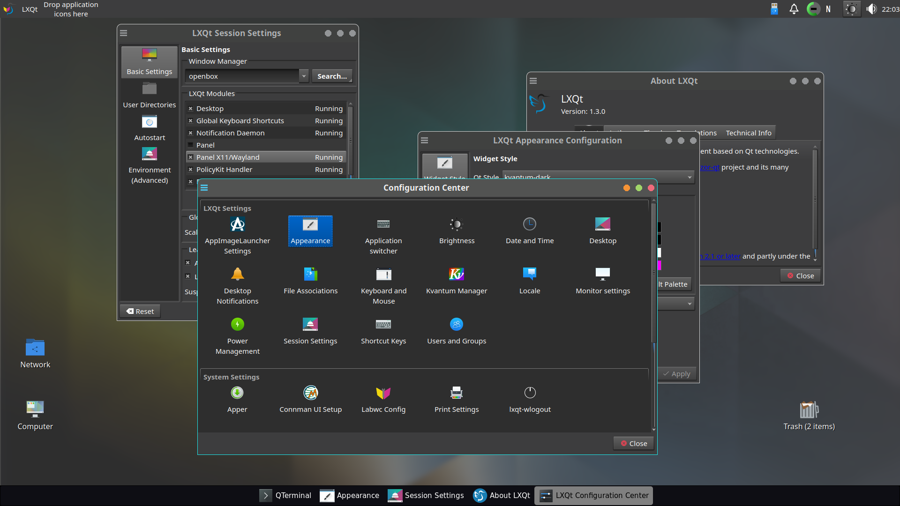
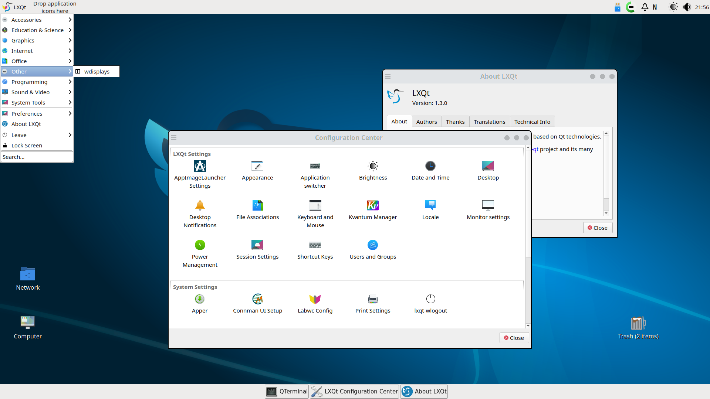

# lxqt-labwc-session

>Files for an LXQt wayland session using the labwc compositor.<


Use your display manager to start "LXQt Labwc".
`startlxqtlabwc` from tty should work too.

## Screenshots



* Widget style: kvantum-dark
* LXQt style: "System"
* labwc: "Vent-dark" theme




* LXQt default settings
* waybar #taskbar: lxqt-style-light.css
* labwc: "Vent" theme

## Dependencies

Build dependencies are `CMake`, [lxqt] 2.0>= and optionally
`Git` to pull latest VCS checkouts. [labwc] version 0.7.0 or higher is recommended.

### Optional:

* swaybg, swaylock, swayidle for screen locking and background.

## Installation

Code configuration is handled by CMake.<br>
CMake variable `CMAKE_INSTALL_PREFIX` has to be set to `/usr` on most operating systems.

```
git clone https://github.com/stefonarch/lxqt-labwc-session.git
cd lxqt-labwc-session
mkdir build && cd build
cmake ..  -DCMAKE_INSTALL_PREFIX=/usr  -DCMAKE_BUILD_TYPE=Debug && make -j4

# Prefer creating a package for your distro instead of using sudo make install

```

## Packages:

For Arch based distributions an [AUR] package is available.

## Notes and Issues

* With LXQt 2.0 no different location for labwc configuration is used anymore as
all components have wayland support now.

* Bottom and right panels have some alignment issues for tooltips and and menu popups.

* LXQt lock settings do not work yet. For screenlock settings under wayland
  please check `~/.config/labwc/autostart`.
  
* Some X11-only applications (example: redshift) in autostart
  can lead to high CPU usage under wayland.

* LXQt Mouse/touchpad and keyboard settings do not work but keyboard layout(s)
  will be imported or set at first run.See
  `~/.config/labwc/environment` and the "libinput" section in `rc.xml`.
  
* Mouse cursor and size are synced and can be set using "Appearance" settings,
session restart required. GTK settings have to be updated after changes.

* Global shortcuts are handled exclusively in `~/.config/labwc/rc.xml`.

* For a background image on loading and closing add
`swaybg -i /usr/share/lxqt/wallpapers/origami-dark.png >/dev/null 2>&1 &` to
`-/.config/labwc/autostart`. This is also the place to autostart wayland-only
applications.

* [Credit] for the original Vent theme

Support: matrix channel [#lxqt-labwc:matrix.org]


[AUR]:                    https://aur.archlinux.org/packages/lxqt-labwc-session-git
[labwc]:                  https://github.com/labwc/labwc/
[lxqt-session]:           https://github.com/lxqt/lxqt/
[sfwbar]:                 https://github.com/LBCrion/sfwbar
[yatbfw]:                 https://github.com/selairi/yatbfw/
[waybar]:                 https://github.com/Alexays/Waybar/
[Credit]:                 https://github.com/addy-dclxvi/openbox-theme-collections
[#lxqt-labwc:matrix.org]: https://matrix.to/#/#lxqt-labwc:matrix.org
