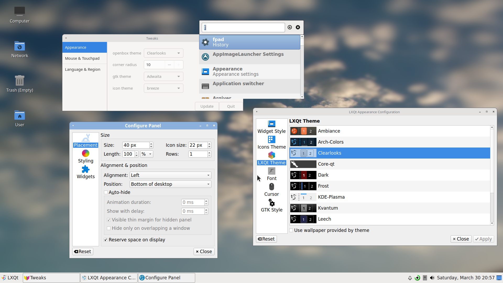
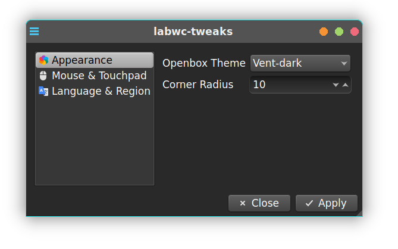

# lxqt-labwc-session

>Files for an LXQt Wayland standalone session using the labwc compositor.

## Archived repository

LXQt 2.1 has been released in November 5th with support for LabWc and many others.

++++++++++++++++++++++++++++++++++++++++++++++++++++++++++++++++++++++++++++++++++

**Notes**:

* The updated version uses the default labwc settings location now, if updating consider moving your settings to `~/.config/labwc.`

* lxqt-panel v2.0 does not include the taskbar-plugin (aka window list) for Wayland, using [lxqt-panel-git](https://aur.archlinux.org/packages/lxqt-panel-git) is recommended until LXQt 2.1 is released. Alternatively sfwbar, waybar or yatbfw can be used to provide a taskbar, see `~/.config/labwc/autostart`.

* Consider using [lxqt-wayland-session](https://github.com/lxqt/lxqt-wayland-session/) which supports 6 compositors. See
 the [Wiki](https://github.com/lxqt/lxqt/wiki/ConfigWaylandSettings) for details.

Use your display manager to start "LXQt Labwc".
`startlxqtlabwc` directly from tty works too.


## Screenshots


* LXQt style: "Valendas"
* labwc: "Vent-dark" theme




* LXQt and Labwc style: "Clearlooks"

## Dependencies

Build dependencies are `CMake`, [lxqt] 2.0>= and optionally
`Git` to pull latest VCS checkouts. [labwc] version 0.7.1 or higher is recommended.

### Optional:

* swaybg, swaylock, swayidle for screen locking and background.

* [labwc-tweaks](https://github.com/labwc/labwc-tweaks): GUI for some basic configuration.
[AUR package](https://aur.archlinux.org/packages/labwc-tweaks-git).



## Installation

Code configuration is handled by CMake.<br>
CMake variable `CMAKE_INSTALL_PREFIX` has to be set to `/usr` on most operating systems.

```
git clone https://github.com/stefonarch/lxqt-labwc-session.git
cd lxqt-labwc-session
mkdir build && cd build
cmake ..  -DCMAKE_INSTALL_PREFIX=/usr  -DCMAKE_BUILD_TYPE=Debug && make -j4

# Prefer creating a package for your distro instead of using sudo make install

```
## Replacements for not (yet) working LXQt elements

* Monitor Settings → [kanshi]
* Global Shortcuts, Input Settings → `/.config/labwc/rc.xml`
* Lock Screen → `swaylock` in `/.config/labwc/autostart`
* ScreenGrab (Screenshots) → [Wshot]
* Colorpicker → [hyprpicker]
* See also [lxqt-panel]

## Changes in version 0.2

* With LXQt 2.0 no different location for labwc configuration is used anymore.
All LXQt components can be configured in "Configuration Center" with some exceptions,
see "Notes" below. Labwc configuration is handled in `~/.config/labwc` and panel position settings by
right click.

* Detection of labwc version: with version 0.7.2 and later `lxqt-session` will close also labwc when exiting.

* Virtualized systems should be autodetected (fixing "no cursor" issue)

* F12 as toggledropdown shortcut for QTerminal is working (using the shipped configuration).

* Improved wallpaper.

## Packages:

For Arch based distributions an [AUR] package is available.

## Notes and Issues

* Default configuration is in `/usr/share/lxqt/wayland/labwc` and copied at first run
if labwc was never configured. Refer to those files if you have already configured labwc.

* LXQt lock settings do not work yet. For screenlock settings under wayland
 please check `~/.config/labwc/autostart`.

* Global shortcuts are handled exclusively in `~/.config/labwc/rc.xml`.

* Use `-/.config/labwc/autostart` to autostart wayland-only applications.

* Mouse cursor and size are synced and can be set using "Appearance" settings,
labwc restart required (`labwc -r` or ctrl-shift-R if  using the shipped configuration).
GTK settings have to be updated after changes.

* Bottom and right panels have some alignment issues for tooltips and and menu popups.

* Some X11-only applications (example: redshift) in autostart
can lead to high CPU usage under wayland.

* LXQt Mouse/touchpad and keyboard settings do not work but keyboard layout(s)
  will be imported and set at startup. See `~/.config/labwc/environment` and the
 "libinput" section in `rc.xml`.

* [Credit] for the original Vent theme

* See also [lxqt-wayland-files]


[AUR]:                    https://aur.archlinux.org/packages/lxqt-labwc-session-git
[labwc]:                  https://github.com/labwc/labwc/
[lxqt-session]:           https://github.com/lxqt/lxqt/
[sfwbar]:                 https://github.com/LBCrion/sfwbar
[yatbfw]:                 https://github.com/selairi/yatbfw/
[waybar]:                 https://github.com/Alexays/Waybar/
[Credit]:                 https://github.com/addy-dclxvi/openbox-theme-collections
[kanshi]:                 https://sr.ht/~emersion/kanshi/
[Wshot]:                  https://github.com/qtilities/wshot
[hyprpicker]:             https://github.com/hyprwm/hyprpicker
[lxqt-wayland-files]:     https://github.com/stefonarch/LXQt-Wayland-files/
[lxqt-panel]:             https://github.com/stefonarch/LXQt-Wayland-files/blob/main/lxqt-panel.md
