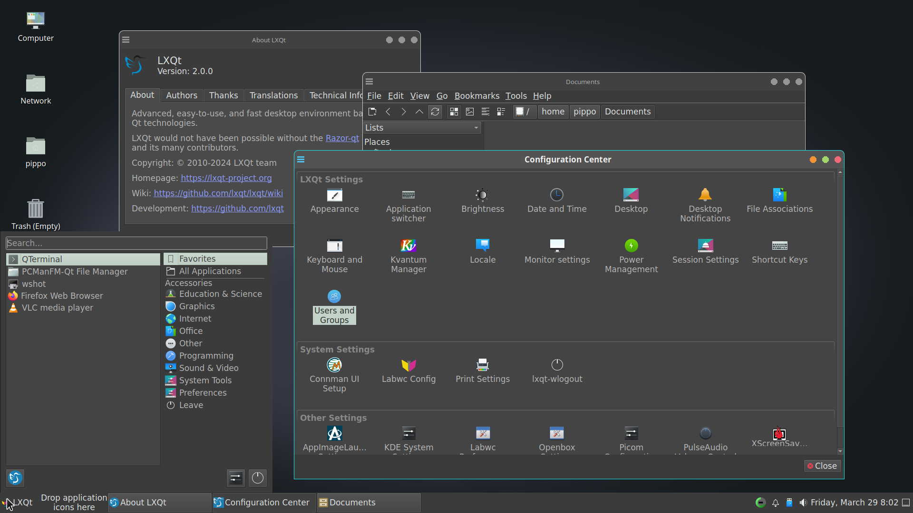

# lxqt-labwc-session

>Files for an LXQt wayland session using the labwc compositor.<


Use your display manager to start "LXQt Labwc".
`startlxqtlabwc` from tty should work too.

## Screenshots



* Widget style: kvantum-dark
* LXQt style: "System"
* labwc: "Vent-dark" theme


* LXQt default settings
* waybar #taskbar: lxqt-style-light.css
* labwc: "Vent" theme

## Dependencies

Build dependencies are `CMake`, [lxqt] 2.0>= and optionally
`Git` to pull latest VCS checkouts. [labwc] version 0.7.2 or higher is recommended.

### Optional:

* [lxqt-notificationd-wip] for better experience with `lxqt-notificationd` (to remove)
* [lxqt-wlogout] for complete logout closing lxqt-session first.
* swaybg, swaylock, swayidle for screen locking and background.

## Installation

Code configuration is handled by CMake.<br>
CMake variable `CMAKE_INSTALL_PREFIX` has to be set to `/usr` on most operating systems.

```
git clone https://github.com/stefonarch/lxqt-labwc-session.git
cd lxqt-labwc-session
mkdir build && cd build
cmake ..  -DCMAKE_INSTALL_PREFIX=/usr  -DCMAKE_BUILD_TYPE=Debug && make -j4

# Prefer creating a package for your distro instead of using sudo make install

```

## Packages:

For Arch based distributions an [AUR] package is available.

## Notes

* LXQt lock settings do not work yet. For screenlock settings under wayland
  please check `~/.config/lxqt-wayland/labwc/autostart`.
  
* Some X11-only applications (example: redshift) in autostart
  can lead to high CPU usage under wayland.
  
* All options for labwc with LXQt are handled in `~/.config/lxqt-wayland/labwc/`. TODO

* LXQt Mouse/touchpad and keyboard settings do not work but keyboard layout(s)
  will be imported or set at first run.See
  `~/.config/lxqt-wayland/labwc/environment` and the "libinput" section in `rc.xml`.
  
* Mouse cursor and size are synced and can be set using "Appearance" settings, session restart required. GTK settings have to be updated after changes.

* Global shortcuts are handled exclusively in `~/.config/lxqt-wayland/labwc/rc.xml`.

* [Credit] for the original Vent theme

Support: matrix channel [#labc-lxqt[(https://matrix.to/#/!JWxuqfyjxmDWUabBkv:sonoj.org/$ZBJ-PJurHTEEms0QEqnMIdKtHVXdEHpRNq7PUDe_OB4?via=matrix.org)


[AUR]:                    https://aur.archlinux.org/packages/lxqt-labwc-session-git
[labwc]:              https://github.com/labwc/labwc/
[lxqt-notificationd-wip]: https://github.com/stefonarch/lxqt-notificationd/tree/wip_layer_shell_qt/
[lxqt-panel]:             https://github.com/stefonarch/LXQt-Wayland-files/blob/main/lxqt-panel.md
[lxqt-session]:           https://github.com/lxqt/lxqt/
[sfwbar]:                 https://github.com/LBCrion/sfwbar
[yatbfw]:                 https://github.com/selairi/yatbfw/
[waybar]:                 https://github.com/Alexays/Waybar/
[lxqt-wlogout]:           https://github.com/stefonarch/lxqt-wlogout
[Credit]:                 https://github.com/addy-dclxvi/openbox-theme-collections
